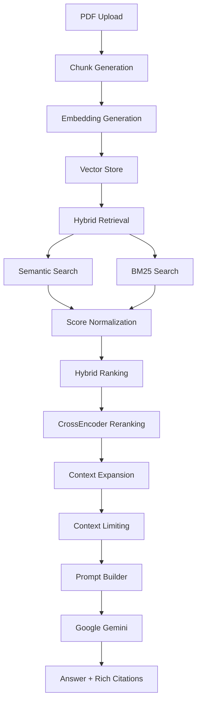
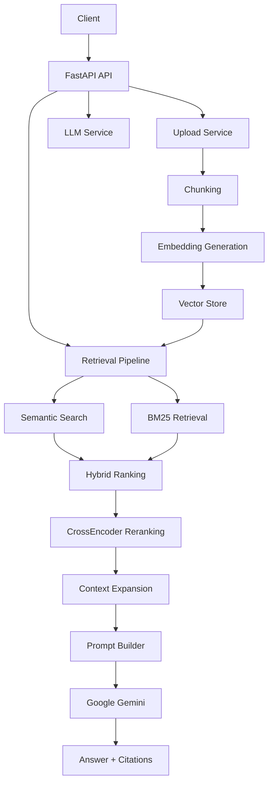
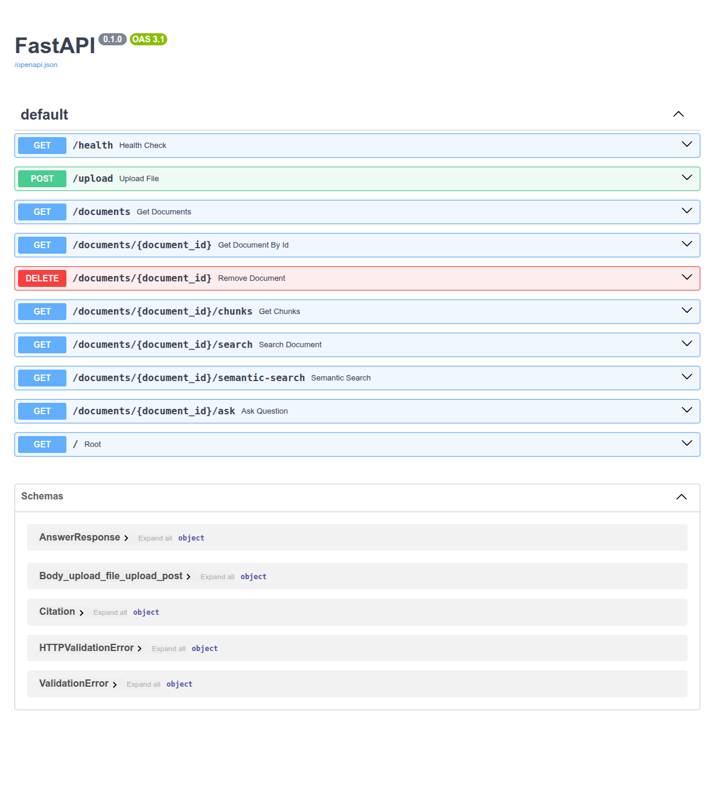

# AI Research Assistant


> ⚠️ **This project is under active development.**
>
> The core architecture is stable, and new production-grade features are being added incrementally.

A production-style **Retrieval-Augmented Generation (RAG)** system built with **FastAPI**, combining semantic search, BM25 retrieval, CrossEncoder reranking, and Google's Gemini models to answer questions from uploaded documents with source citations.

## Table of Contents

- [Why this Project?](#why-this-project)
- [Overview](#overview)
- [Project Goals](#project-goals)
- [Features](#features)
- [Retrieval Pipeline](#retrieval-pipeline)
- [Architecture](#architecture)
- [Key Design Principles](#key-design-principles)
- [Tech Stack](#tech-stack)
- [Project Structure](#project-structure)
- [Design Decisions](#design-decisions)
- [REST API](#rest-api)
- [Getting Started](#getting-started)
- [Current Limitations](#current-limitations)
- [Roadmap](#roadmap)
- [Screenshots](#screenshots)
- [License](#license)

---

# Why this project?

Unlike many demonstration RAG applications, this project is being
developed incrementally with a strong emphasis on software
engineering principles.

The primary goal is not only to build a functional RAG system,
but also to design a maintainable backend architecture suitable
for real-world production systems.

---

# Overview

AI Research Assistant is a backend application that allows users to upload PDF documents and ask natural language questions about their content.

Instead of relying solely on vector similarity, the system combines multiple retrieval techniques—including semantic search, BM25 keyword retrieval, hybrid ranking, and CrossEncoder reranking—to improve retrieval quality before generating answers using a Large Language Model (LLM).

The project is being developed incrementally with a strong focus on software engineering practices, clean architecture, maintainability, and production-oriented system design.

---

# Project Goals

This project is designed not only to build a RAG system, but also to practice and demonstrate:

- Software Engineering
- Clean Architecture
- Backend Development with FastAPI
- Retrieval-Augmented Generation (RAG)
- Information Retrieval
- Production AI System Design
- Git & GitHub Workflow
- Maintainable and Scalable Code

---

# Features

Current implemented features include:

- ✅ PDF upload & processing
- ✅ Automatic text extraction
- ✅ Paragraph-aware chunking
- ✅ Sentence overlap
- ✅ Embedding generation
- ✅ File-based vector storage
- ✅ Semantic retrieval
- ✅ BM25 retrieval
- ✅ Hybrid ranking
- ✅ CrossEncoder reranking
- ✅ Context expansion
- ✅ Retrieval-Augmented Question Answering
- ✅ Rich source citations
- ✅ Google Gemini integration

---

# Retrieval Pipeline



---

# Architecture

The project follows a layered architecture where each service has a single responsibility.



The retrieval pipeline is intentionally decoupled from prompt generation and LLM communication, allowing components to evolve independently.

---

# Key Design Principles

- Single Responsibility Principle
- Layered Architecture
- Service-oriented design
- Incremental feature development
- Git feature-branch workflow
- Readability over cleverness

---

# Tech Stack

| Layer             | Technology                            |
| ----------------- | ------------------------------------- |
| Language          | Python 3.14                           |
| Web Framework     | FastAPI                               |
| API Documentation | OpenAPI/Swagger UI                    |
| Validation        | Pydantic v2                           |
| Embeddings        | sentence-transformers                 |
| Embedding Model   | all-MiniLM-L6-v2                      |
| Keyword Retrieval | BM25                                  |
| Reranker          | cross-encoder/ms-marco-MiniLM-L-6-v2  |
| LLM               | Google Gemini (gemini-3.1-flash-lite) |
| PDF Processing    | pypdf                                 |
| Testing           | pytest                                |
| Version Control   | Git & GitHub                          |

---

# Project Structure

```text
app/
├── api/            # REST API routers
├── core/           # Application configuration
├── models/         # Pydantic models
├── services/       # Business logic
├── utils/          # Shared utilities
└── main.py

data/
├── chunks/
├── metadata/
├── processed/
└── uploads/

scripts/            # Utility & evaluation scripts
tests/              # Unit tests
```

---

# Design Decisions

Several architectural decisions were made intentionally throughout development.

### Hybrid Retrieval

Semantic search alone is not sufficient.

Keyword search alone is not sufficient.

Both retrieval methods are combined to improve overall retrieval quality.

---

### CrossEncoder Reranking

The CrossEncoder model is applied only to the candidate chunks returned by hybrid retrieval rather than the entire corpus, significantly reducing computational cost.

---

### Context Expansion

Context expansion is performed **after reranking** so that neighboring chunks are only added around the highest-quality retrieval results.

---

### Separation of Responsibilities

Each service has a single responsibility.

For example:

- Prompt Builder does not know how retrieval works.
- LLM Service does not know how documents are searched.
- Hybrid Search coordinates the retrieval pipeline while other services remain focused on a single task.

---

### Retrieval Pipeline Coordinator

The entire retrieval pipeline is orchestrated by
`hybrid_search_service.py`.

Individual services remain responsible for only one task,
keeping the pipeline modular and maintainable.

---

# REST API

Current available endpoints include:

| Method | Endpoint                                   | Purpose                           |
| ------ | ------------------------------------------ | --------------------------------- |
| GET    | `/`                                        | Root endpoint                     |
| GET    | `/health`                                  | Check application health          |
| POST   | `/upload`                                  | Upload and process a PDF document |
| GET    | `/documents`                               | List all indexed documents        |
| GET    | `/documents/{document_id}`                 | Retrieve document metadata        |
| DELETE | `/documents/{document_id}`                 | Delete a document                 |
| GET    | `/documents/{document_id}/chunks`          | Retrieve document chunks          |
| GET    | `/documents/{document_id}/semantic-search` | Semantic search                   |
| GET    | `/documents/{document_id}/search`          | Hybrid retrieval                  |
| GET    | `/documents/{document_id}/ask`             | Ask questions about a document    |

---

# Getting Started

## Clone the repository

```bash
git clone https://github.com/pouya3883/ai-research-assistant.git
cd ai-research-assistant
```

## Create a virtual environment

```bash
python -m venv .venv
```

Activate it:

Linux/macOS

```bash
source .venv/bin/activate
```

Windows

```bash
.venv\Scripts\activate
```

## Install dependencies

```bash
pip install -r requirements.txt
```

## Configure environment variables

Create a `.env` file and configure your Gemini API key.

```text
GEMINI_API_KEY=your_api_key
```

## Run the application

```bash
uvicorn app.main:app --reload
```

The API will be available at:

```
http://127.0.0.1:8000
```

Swagger UI:

```
http://127.0.0.1:8000/docs
```

---

# Current Limitations

The current implementation intentionally has the following limitations:

- Single-document retrieval only
- File-based vector storage
- No metadata filtering
- No streaming responses
- No conversation memory
- No automatic retrieval evaluation metrics
- Limited integration test coverage

---

# Roadmap

Planned future improvements include:

- Multi-document retrieval
- Persistent vector database
- Streaming responses
- Metadata filtering
- Retrieval evaluation framework
- Conversation memory
- Docker support
- CI/CD pipeline
- Production deployment

---

# Screenshots

## Swagger UI



---

# License

This project is licensed under the MIT License.
